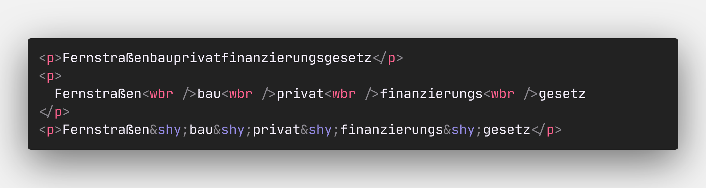

<!-- .slide: data-state="layout-title"  -->

# Low budget, cool HTML

## HTML <del>sucks</del> <ins>rocks</ins>!

---

<!-- .slide: data-state="layout-title" data-transition="zoom" class="bg-dark"-->

# `<a>` Element `ping` Attribute

---

<!-- .slide: data-transition="none" -->

# <a href="https://codesandbox.io/s/a-ping-attribute-spb95" target="_blank">`ping`</a>

<iframe src="https://codesandbox.io/embed/a-ping-attribute-spb95?fontsize=14&hidenavigation=1&theme=dark"
     style="width:100%; height:500px; border:0; border-radius: 4px; overflow:hidden;"
     title="a-ping-attribute"
     allow="accelerometer; ambient-light-sensor; camera; encrypted-media; geolocation; gyroscope; hid; microphone; midi; payment; usb; vr; xr-spatial-tracking"
     sandbox="allow-forms allow-modals allow-popups allow-presentation allow-same-origin allow-scripts"
   ></iframe>

---

# `<a>` Element `download` Attribut

```html
<a href="#" download>Download me</a>
```

<iframe src="../examples/a-download-attribute.html" style="width:100%; height:500px; border:0; border-radius: 4px; overflow:hidden;"></iframe>

---

# CSS :target Selector for SPA like View Navigation

<iframe src="../examples/css-target-selector.html" style="width:100%; height:500px; border:0; border-radius: 4px; overflow:hidden;"></iframe>

---

# HTML and controlled Word-breaks



---

# Example for controlled Word-breaks `<wbr>`

<iframe src="../examples/wbr-word-break.html" style="width:100%; height: 50vh; border:0; border-radius: 4px; overflow:hidden;"></iframe>

---

# Inline Text markup

<iframe src="../examples/inline-text-markup.html" style="width:100%; height: 50vh; border:0; border-radius: 4px; overflow:hidden;"></iframe>

---

# How to check for JavaScript availability without JavaScript?

Simple way to check for JS availability with `<noscript>` and cookies:

```html
<noscript>
  <meta http-equiv="Set-Cookie" content="hasjs=false; path=/" />
  <meta http-equiv="Refresh" content="0" />
</noscript>
```

[Article](https://www.codeproject.com/Tips/1217469/How-to-Detect-if-Client-has-JavaScript-Enabled-Dis)

---

# Fine-tuning `<input>` elements for File Uploads 

File upload -> Restrict file types

`<input type="file" accept=".xls,.xlsx" />`

Allow upload of multiple files, or emails via `multiple` attribute.

`<input type=”file” multiple>` -> Allows to specify multiple files.

`<input type=”email” multiple>` -> Allows to specify multiple comma separated email addresses.

---

# Display Form validation state via CSS

<iframe width="100%" height="300" src="//jsfiddle.net/thomasdarimont/yp3z4o7b/3/embedded/" allowfullscreen="allowfullscreen" allowpaymentrequest frameborder="0"></iframe>

---

# Auto-complete in forms fine-tunen

[Article](https://developer.mozilla.org/en-US/docs/Web/HTML/Attributes/autocomplete#values)

---

# Lazy loading of Images

```html

```

[Article](https://web.dev/browser-level-image-lazy-loading/)

---

# Protect your users Privacy with `<a>` attributes 

```html
<a href="https://www.example.com" rel="noopener noreferrer nofollow">Link</a>
```

[Article](https://pointjupiter.com/what-noopener-noreferrer-nofollow-explained/)

---

# Protect your users Privacy with default Referrer Policy

```html
<meta name="referrer" content="default" />
```

[Article](https://w3c.github.io/webappsec-referrer-policy/#referrer-policy)

---

# Change form Method via `<input>` Attribut `formmethod`

Change http method to submit form for input elements via formmethod attribute

[Artikel](https://html.spec.whatwg.org/multipage/form-control-infrastructure.html#attr-fs-formmethod)

---

# Simple autocompletion with `<datalist>`

```html
<label for="ice-cream-choice">Choose a flavor:</label>
<input list="ice-cream-flavors" id="ice-cream-choice" name="ice-cream-choice" />

<datalist id="ice-cream-flavors">
  <option value="Chocolate"></option>
  <option value="Coconut"></option>
  <option value="Mint"></option>
  <option value="Strawberry"></option>
  <option value="Vanilla"></option>
</datalist>
```

<label for="ice-cream-choice">Choose a flavor:</label>
<input list="ice-cream-flavors" id="ice-cream-choice" name="ice-cream-choice" />

<datalist id="ice-cream-flavors">
  <option value="Chocolate"></option>
  <option value="Coconut"></option>
  <option value="Mint"></option>
  <option value="Strawberry"></option>
  <option value="Vanilla"></option>
</datalist>

https://developer.mozilla.org/en-US/docs/Web/HTML/Element/datalist

---

# Built-in expandables with `<details>` & `<summary>`

```html
<details>
  <summary>System Requirements</summary>
  <p>
    Requires a computer running an operating system. The computer must have some
    memory and ideally some kind of long-term storage. An input device as well
    as some form of output device is recommended.
  </p>
</details>
```

<details>
  <summary>System Requirements</summary>
  <p>Requires a computer running an operating system. The computer
  must have some memory and ideally some kind of long-term storage.
  An input device as well as some form of output device is
  recommended.</p>
</details>

https://developer.mozilla.org/en-US/docs/Web/HTML/Element/details

---

# Integrate animated SVGs in HTML

<iframe width="100%" height="300" src="//jsfiddle.net/zrhL1jqx/embedded/" allowfullscreen="allowfullscreen" allowpaymentrequest frameborder="0"></iframe>
